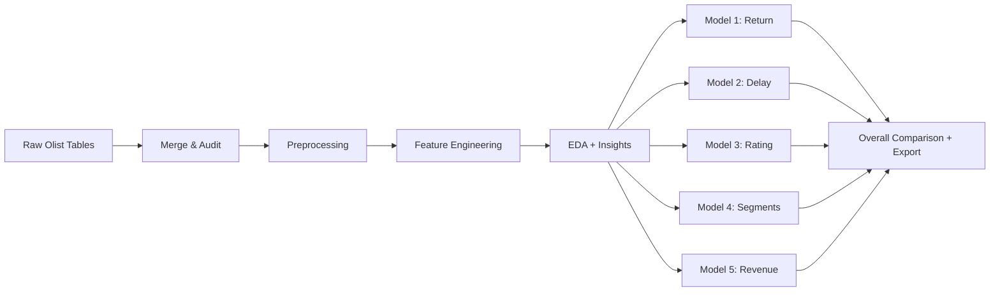

<div align="center">

# 🛒 E-Commerce Capstone — 5 ML Models on Real Marketplace Data

### Classification · Regression · Clustering — one shared pipeline, five production-grade models

[](https://www.python.org/)
[](https://scikit-learn.org/)
[](https://pandas.pydata.org/)
[](https://jupyter.org/)
[](https://www.kaggle.com/datasets/olistbr/brazilian-ecommerce)
[](#-license)

**Predict cancellations, predict delays, predict ratings, segment customers, forecast revenue — from one clean data pipeline.**

[Overview](#-overview) · [Models](#-the-5-models) · [How to Use](#-how-to-use) · [Methodology](#-methodology) · [Results](#-results) · [Repo Structure](#-repo-structure) · [Limitations](#-limitations)

</div>

---

## 📌 Overview

This capstone runs the full ML lifecycle — audit → clean → engineer → model → tune → evaluate → explain — on the [Brazilian E-Commerce Public Dataset by Olist](https://www.kaggle.com/datasets/olistbr/brazilian-ecommerce) (~100K real orders, 2016–2018). One shared preprocessing phase feeds **five independent models** spanning all three core ML task types, each with its own leakage checks, tuning, diagnostics, and business write-up.

> 💡 **Why this dataset instead of the brief's synthetic schema?** The original brief assumes fields Olist doesn't have (`Returned` flag, `age_group`, `Sales_Channel`, `brand`, `discount_percent`). Every substitution is called out inline in the notebook the moment it's used — nothing is invented. See [Limitations](#-limitations).

## 🧠 The 5 Models

| # | Model | Task | Target | Algorithms Compared |
|:-:|-------|------|--------|----------------------|
| 1️⃣ | **Return Prediction** | Binary Classification | `is_canceled` *(proxy for `Returned`)* | Logistic Regression · Decision Tree · Random Forest · KNN |
| 2️⃣ | **Delivery Delay Prediction** | Binary Classification | `is_late` | Logistic Regression · Decision Tree · Random Forest · KNN |
| 3️⃣ | **Customer Rating Prediction** | Regression | `review_score` (1–5) | Linear Regression · Decision Tree · Random Forest · KNN |
| 4️⃣ | **Customer Segmentation** | Unsupervised Clustering | RFM + behavioral features | K-Means · DBSCAN · Agglomerative |
| 5️⃣ | **Revenue Prediction** | Regression | `net_revenue` | Linear Regression · Decision Tree · Random Forest · KNN |

## ⚙️ Pipeline



Each model branch follows the same rigor: **leakage check → train/test split → `ColumnTransformer` + `Pipeline` (fit on train only) → compare 4 algorithms → imbalance/log-target comparison → `GridSearchCV` tuning on the winner → final evaluation → diagnostics → error analysis → business recommendations → export.**

## 🚀 How to Use

### 1. Clone & install

```bash
git clone https://github.com/<your-username>/<repo-name>.git
cd <repo-name>
pip install -r requirements.txt
```

<details>
<summary><strong>No <code>requirements.txt</code> yet? Click to install manually</strong></summary>

```bash
pip install pandas numpy scikit-learn imbalanced-learn matplotlib seaborn joblib kagglehub jupyter
```
</details>

### 2. Open the notebook

```bash
jupyter notebook Capstone_Models_1_to_5.ipynb
```

The dataset auto-downloads on the first code cell via `kagglehub.dataset_download("olistbr/brazilian-ecommerce")` — no manual download step. A free Kaggle account is required for `kagglehub` auth on first run.

### 3. Run top to bottom

The notebook is fully sequential — shared phase first, then Models 1 → 5 in order, then the overall comparison. Re-running end-to-end reproduces every table, plot, and exported artifact from scratch (`RANDOM_STATE = 42` throughout, so results are deterministic).

### 4. Load a trained model without retraining

Every tuned model is exported to `model/` as a `joblib` pickle. Skip training entirely and go straight to inference:

```python
import joblib

# e.g. the Return Prediction pipeline (includes preprocessing)
model = joblib.load("model/model1_best_return_prediction.pkl")

predictions = model.predict(X_new)          # class labels
probabilities = model.predict_proba(X_new)  # risk scores
```

Repeat with `model2_best_delay_prediction.pkl`, `model3_best_rating_prediction.pkl`, `best_model.pkl` (Model 4 clustering), and `model5_best_revenue_prediction.pkl`.

### 5. Explore results without re-running anything

Every comparison table, metric set, and error breakdown is already sitting in `reports/` as `.csv` — open them directly if you just want the numbers.

## 🔬 Methodology

- **Imbalance handling (Models 1 & 2):** `class_weight='balanced'` vs. no adjustment, decision-threshold tuning via precision-recall curve, and SMOTE oversampling on the training fold only. Both targets are heavily imbalanced (~0.5% and ~8% positive class), so **F1-macro and ROC-AUC lead over Accuracy** everywhere.
- **Leakage control:** post-outcome fields (delivery dates/status, reviews, cancellation/return details) are stripped from features for any model they'd leak into. An earlier Model 2 draft scored a suspicious perfect 1.00 on every metric — traced to leaked delivery-date columns and fixed; that debugging trail is documented in the notebook.
- **Regression targets (Models 3 & 5):** raw vs. log-transformed target compared explicitly; metrics are reported after inverse-transforming predictions back to the original scale.
- **Clustering (Model 4):** *K* selected via elbow + silhouette search across K=2–8 (best silhouette at **K=6**); final algorithm chosen by highest silhouette **and** lowest Davies-Bouldin Index, with a check that no cluster is a tiny sliver or a majority-swallowing blob. Segments are named from real unscaled behavior — e.g. a ~28%-of-customers "High-Revenue Core" segment generating over half of total revenue.

## 📊 Results

<div align="center">

| Task Type | Models Compared | Metric | 
|:---------:|:----------------:|:------:|
| Classification | Model 1 vs Model 2 | Accuracy · Precision · Recall · F1-macro · ROC-AUC |
| Regression | Model 3 vs Model 5 | MAE · RMSE · R² |
| Clustering | Model 4 (standalone) | Silhouette Score · Davies-Bouldin Index |

</div>

Full metrics, comparison tables, and feature importances live in [`reports/`](./reports). The complete narrative — findings, business meaning, and recommendations per model — is in the notebook and in [`Capstone_ML_Project_Report.docx`](./Capstone_ML_Project_Report.docx).

## 📂 Repo Structure

```
.
├── 📓 Capstone_Models_1_to_5.ipynb       # full notebook — shared phase + all 5 models
├── 📄 Capstone_ML_Project_Report.docx    # written project report
├── 📁 data/                              # cleaned / engineered datasets per model
├── 📁 model/                             # tuned best model per task (.pkl, joblib)
│   ├── model1_best_return_prediction.pkl
│   ├── model2_best_delay_prediction.pkl
│   ├── model3_best_rating_prediction.pkl
│   ├── best_model.pkl                    # Model 4 — clustering
│   └── model5_best_revenue_prediction.pkl
└── 📁 reports/                           # comparison tables, metrics, feature importance, error analysis (.csv)
```

## ⚠️ Limitations

- **No explicit `Returned` field** — `is_canceled` used as the closest available proxy; a canceled order is not identical to a returned one.
- **No demographic fields** — `customer_state` and `preferred_payment_type` substitute for `age_group` / `preferred_channel`, since Olist has neither.
- **No discount data** — `net_revenue` for Model 5 is computed as `unit_price × quantity` with the discount term fixed at 0.
- **No brand or channel fields** — `product_category_name_english` substitutes for `brand`; every order is online marketplace by definition, so `channel` has no variation to model.
- **Correlation, not causation** — feature importances describe predictive association only.

## 🛠️ Tech Stack

`Python` · `pandas` · `NumPy` · `scikit-learn` · `imbalanced-learn` · `matplotlib` · `seaborn` · `joblib` · `kagglehub`

## 📄 License

MIT — free to use, adapt, and build on.

---

<div align="center">

**Dataset:** Brazilian E-Commerce Public Dataset by Olist &nbsp;·&nbsp; **Random State:** 42

</div>
